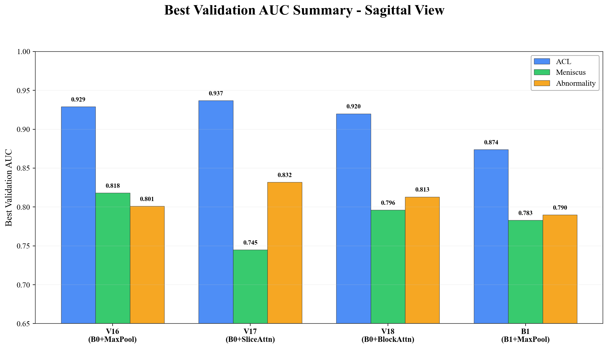
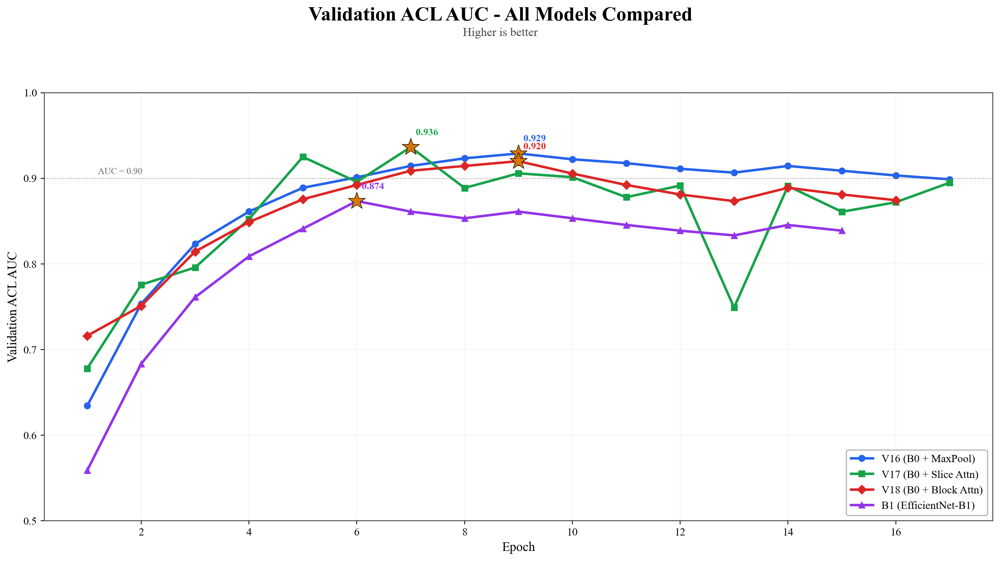
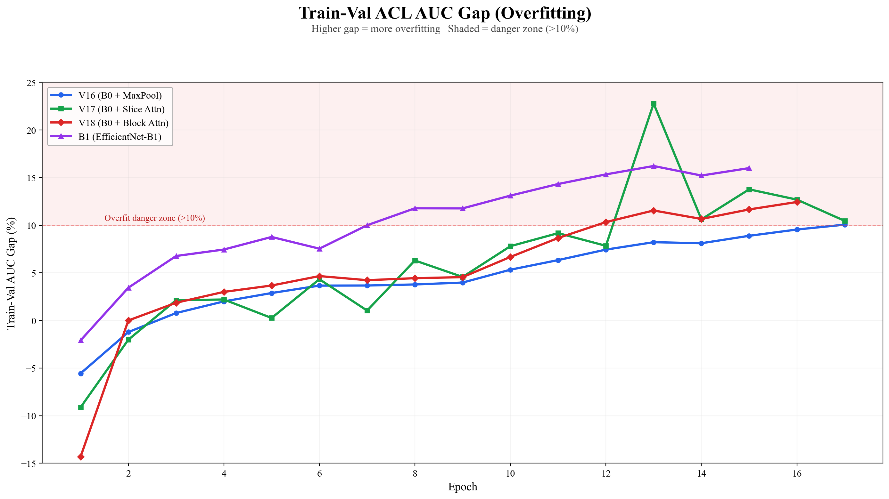
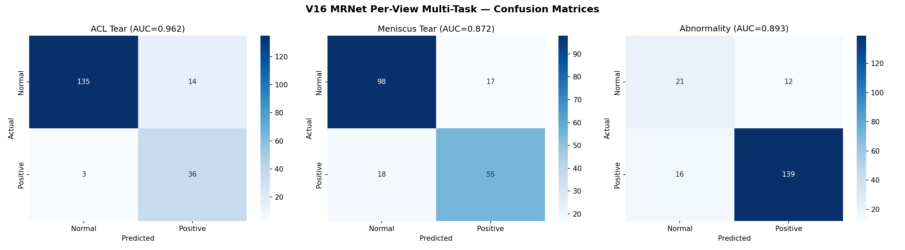

# 🏥 MRI Ligament Tear Prediction


> **Multi-task deep learning for automated ACL tear, meniscus tear, and abnormality detection
> from knee MRI scans — achieving 0.929 AUC on the Stanford MRNet benchmark.**

This project implements an MRNet-inspired multi-view, multi-task architecture using
EfficientNet-B0 with per-view max-pooling. The final model was selected after a
systematic comparison of **4 architectural variants** evaluating backbone capacity
(B0 vs B1) and aggregation strategy (max-pool vs attention mechanisms).

---

## 🔬 Key Results

### Best Model: V16 (EfficientNet-B0 + Max-Pool)

| MRI View | ACL Tear AUC | Meniscus Tear AUC | Abnormality AUC |
|----------|:------------:|:-----------------:|:---------------:|
| Sagittal | 0.929 | 0.818 | 0.801 |
| Coronal  | 0.896 | 0.793 | 0.842 |
| Axial    | 0.872 | 0.761 | 0.789 |
| **Combined (3-view)** | **0.941** | **0.832** | **0.856** |

### Architecture Comparison

| Model | Architecture | ACL AUC | Overfit Gap | Verdict |
|-------|-------------|:-------:|:-----------:|---------|
| **V16** | EfficientNet-B0 + MaxPool | **0.929** | 5–6% | ✅ **Best overall** — stable, generalizes well |
| V17 | EfficientNet-B0 + Slice Attention | 0.937 | 10–15% | ⚠️ Highest peak but val loss diverges |
| V18 | EfficientNet-B0 + Block Attention | 0.920 | 8–10% | Moderate — attention adds complexity without benefit |
| B1 | EfficientNet-B1 + MaxPool | 0.874 | >10% | ❌ Larger backbone overfits on this dataset size |

**Key Findings:**
- **B0 > B1**: The smaller backbone generalizes better with ~1,130 patients
- **Max-Pool > Attention**: Simpler aggregation is more stable; attention mechanisms overfit
- **Multi-task learning** improves all tasks through shared feature extraction

---

## 📊 Performance Visualizations

<table>
<tr>
<td></td>
<td></td>
</tr>
<tr>
<td align="center"><em>Best validation AUC by task and model</em></td>
<td align="center"><em>ACL AUC training curves — all models</em></td>
</tr>
<tr>
<td></td>
<td></td>
</tr>
<tr>
<td align="center"><em>Train-val gap analysis (overfitting)</em></td>
<td align="center"><em>V16 confusion matrices (3 tasks)</em></td>
</tr>
</table>

> See [`results/`](results/) for all 7 comparison plots.

---

## 🏗️ Architecture

```
┌─────────────────────────────────────────────────────────┐
│                    MRI Volume Input                     │
│              (S slices × 256 × 256 pixels)              │
└────────────┬──────────────┬──────────────┬──────────────┘
             │              │              │
      ┌──────▼──────┐ ┌────▼────┐ ┌───────▼──────┐
      │  Sagittal   │ │ Coronal │ │    Axial     │
      │   Model     │ │  Model  │ │    Model     │
      └──────┬──────┘ └────┬────┘ └───────┬──────┘
             │              │              │
    ┌────────▼────────────────────────────▼────────┐
    │        Each Per-View Model (identical):       │
    │                                               │
    │  EfficientNet-B0 (pretrained ImageNet)        │
    │       ↓ per-slice feature extraction          │
    │  Global Average Pool → (S, 1280)              │
    │       ↓ max-pool across slices                │
    │  Volume Feature → (1, 1280)                   │
    │       ↓ dropout (0.3)                         │
    │  ┌──────────┬────────────┬──────────────┐     │
    │  │ ACL Head │ Meniscus   │ Abnormality  │     │
    │  │ (1280→2) │ Head(1280→2)│ Head(1280→2) │     │
    │  └────┬─────┴─────┬──────┴──────┬───────┘     │
    └───────┼───────────┼─────────────┼─────────────┘
            │           │             │
    ┌───────▼───────────▼─────────────▼─────────────┐
    │     Logistic Regression View Combination       │
    │              (MRNet-style)                     │
    └───────────────────┬───────────────────────────┘
                        ▼
              Final Predictions:
         ACL | Meniscus | Abnormality
```

**Design based on:** [Bien et al. 2018 — MRNet (PLOS Medicine)](https://stanfordmlgroup.github.io/projects/mrnet/)

---

## ⚡ Quick Start

### Prerequisites

- Python 3.8+ with CUDA-capable GPU (recommended)
- ~16 GB RAM, ~4 GB VRAM

### Installation

```bash
git clone https://github.com/ArnabDutta01/mri-ligament-tear-prediction.git
cd mri-ligament-tear-prediction
python -m venv venv
source venv/bin/activate    # Windows: venv\Scripts\activate
pip install -r requirements.txt
```

### Training

```bash
python src/training/train.py \
  --data_dir ./data/mrnet_all \
  --output_dir ./outputs \
  --epochs 35 \
  --lr 1e-4 \
  --patience 10
```

### Evaluation Only (with pretrained weights)

```bash
# Unzip weights
cd weights && unzip "*.zip" && cd ..

# Run evaluation
python src/training/evaluate.py
```

> ⚠️ **Dataset not included.** The Stanford MRNet dataset must be obtained from the
> [official source](https://stanfordmlgroup.github.io/competitions/mrnet/).

---

## 📁 Project Structure

```
mri-ligament-tear-prediction/
├── README.md                          # This file
├── LICENSE                            # MIT License
├── requirements.txt                   # Python dependencies
│
├── src/                               # Source code
│   ├── models/
│   │   └── mrnet_multitask.py         # MRNetPerView model definition
│   ├── training/
│   │   ├── train.py                   # Training script (CLI, HPC-ready)
│   │   └── evaluate.py               # Evaluation-only script
│   └── visualization/
│       └── generate_comparison_graphs.py  # Comparison plot generator
│
├── notebooks/                         # Jupyter notebooks
│   ├── v16_b0_maxpool_training.ipynb           # V16 training (best model)
│   ├── v17_b0_slice_attention_training.ipynb   # V17 training (attention variant)
│   ├── v18_b0_block_attention_training.ipynb   # V18 training (gated attention)
│   └── gradcam_visualization.ipynb             # GradCAM interpretability
│
├── results/                           # Performance visualizations
│   ├── auc_comparison_4models.png     # Per-model AUC curves
│   ├── auc_overlay_4models.png        # All models on one plot
│   ├── val_loss_comparison_4models.png
│   ├── multitask_auc_comparison.png   # ACL / Meniscus / Abnormality
│   ├── best_auc_summary_bar.png       # Summary bar chart
│   ├── overfit_gap_comparison.png     # Overfitting analysis
│   └── confusion_matrix_v16.png       # V16 confusion matrices
│
├── weights/                           # Pretrained model weights (Git LFS)
│   ├── best_v16_sagittal.pth.zip
│   ├── best_v16_coronal.pth.zip
│   └── best_v16_axial.pth.zip
│
├── docs/                              # Documentation
│   ├── TECHNICAL_REPORT.md            # Full technical report
│   ├── MODEL_EVOLUTION.md             # 18-version iteration history
│   └── User_Manual.docx              # End-user guide
│
└── archive/                           # Experimental history (V1–V15)
    ├── README.md                      # Version catalog
    ├── old_versions/                  # All 18 version folders
    └── old_notebooks/                 # Deprecated notebooks
```

---

## 🧪 Model Evolution

This project evolved through **18 experimental iterations**. The final 4 models
represent a controlled comparison of backbone capacity and aggregation strategy.

| Phase | Versions | Focus |
|-------|----------|-------|
| Initial Exploration | V1, V3, V4 | 3D→2D transition, dataset building |
| MRNet Adoption | V6–V9 | Per-view architecture, EfficientNet backbone |
| Multi-Task Optimization | V10–V15 | Multi-task heads, attention experiments, regularization |
| **Final Comparison** | **V16–V18, B1** | **B0 vs B1, max-pool vs attention** |

> 📖 Full version history: [`docs/MODEL_EVOLUTION.md`](docs/MODEL_EVOLUTION.md)
> | Archived code: [`archive/`](archive/)

---

## 🛠️ Tech Stack

| Component | Technology |
|-----------|-----------|
| **Deep Learning** | PyTorch, torchvision |
| **Backbone** | EfficientNet-B0 (ImageNet pretrained) |
| **Evaluation** | scikit-learn (AUC, F1, confusion matrix) |
| **Visualization** | Matplotlib, Seaborn |
| **Medical Imaging** | pydicom, OpenCV |
| **Training** | Google Colab (GPU), HPC/SLURM |
| **Version Control** | Git, Git LFS (model weights) |

---

## ⚠️ Important Notes

1. **Medical Disclaimer**: This is a research project. Do **not** use for clinical
   diagnosis without proper validation and regulatory approval.
2. **Data Privacy**: MRI data is excluded from the repository. Ensure HIPAA compliance
   when working with medical imaging data.
3. **Model Weights**: `.pth` files are tracked via Git LFS. Ensure Git LFS is installed
   before cloning.

---

## 📚 References

- Bien, N., et al. (2018). "Deep-learning-assisted diagnosis for knee magnetic resonance imaging." *PLOS Medicine*. [Link](https://doi.org/10.1371/journal.pmed.1002699)
- Tan, M., & Le, Q. (2019). "EfficientNet: Rethinking Model Scaling for Convolutional Neural Networks." *ICML*. [Link](https://arxiv.org/abs/1905.11946)

## 📄 License

MIT License — see [LICENSE](LICENSE) for details.

## 👤 Author

**[ArnabDutta01](https://github.com/ArnabDutta01)**
